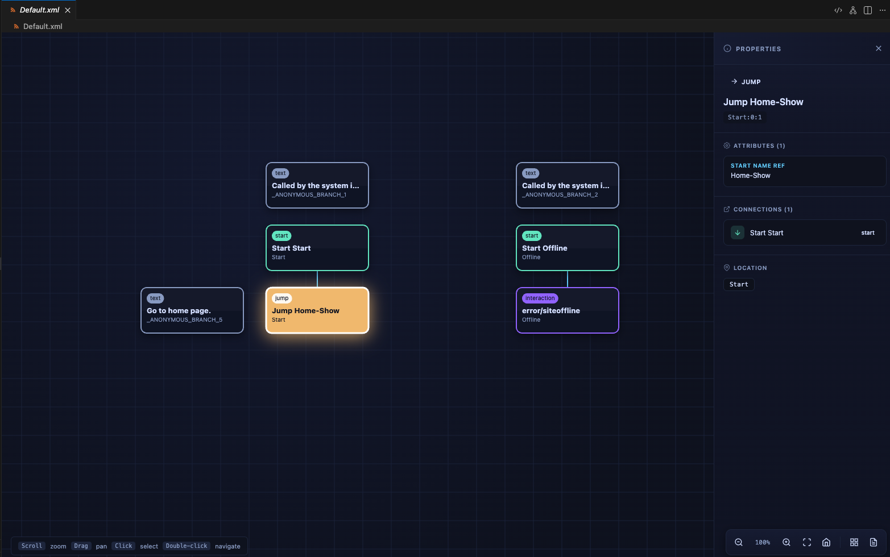
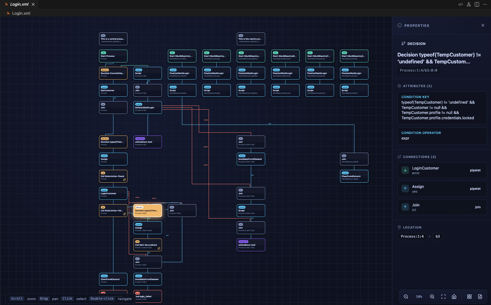
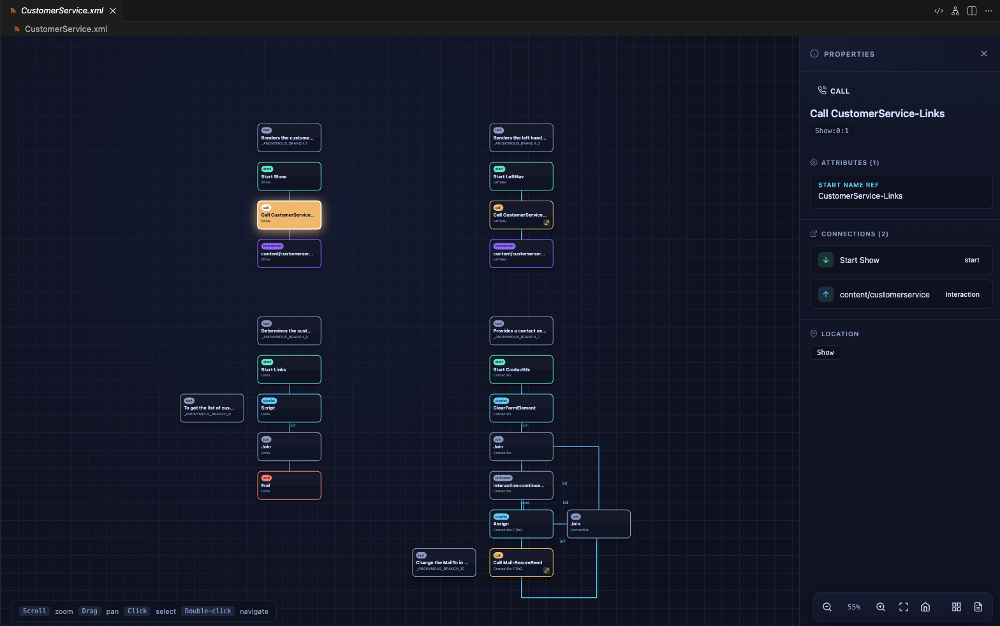

# SFCC Manifold

VS Code extension that visualizes Salesforce B2C Commerce (Demandware) **pipeline XML** as an interactive graph.

This project focuses on *reading and understanding* legacy pipelines quickly: open a pipeline file, pan/zoom around the graph, click nodes/edges to inspect details, and follow `call-node` / `jump-node` links across pipelines.

## What you get

- **Custom editor** for pipeline XML (graph view by default for matching files).
- **Interactive canvas**: drag to pan, scroll/trackpad to zoom, fit/reset controls.
- **Sidebar** with pipeline metadata (name/group/type/description), node/edge counts, and a legend.
- **Properties panel** (bottom panel, resizable): click a node or an edge to inspect attributes and connections.
  - **Improved pipelet properties**: detailed view of pipelet configuration, parameters, and mappings.
- **Fast navigation**:
	- Click a connection in the Properties panel to jump to its node.
	- Double‑click `call`/`jump` nodes to navigate to the referenced start node.
	- Cross‑pipeline navigation is supported when `start-name-ref` follows the common `PipelineName-StartNodeName` convention.

## Screenshots

### Default pipeline view

### Login pipeline view

### Customer Service pipeline view

## Supported files

By default the extension registers a custom editor for:

- `**/pipelines/*.xml`
- `**/pipeline_examples/*.xml`

You can also open any `.xml` file in the visualizer via a command (see below).

## Commands

- **SFCC Manifold: Open SFCC Pipeline Visualiser** (`sfccManifold.open`)
	- Opens the active XML file (or prompts you to pick one) in the custom editor.
- **SFCC Manifold: Open Pipeline Visualizer** (`sfccManifold.openVisualizer`)
	- Opens the currently active text editor document in the visualizer.
- **SFCC Manifold: Open Pipeline Source XML** (`sfccManifold.openSource`)
	- When you’re viewing the graph, switches that same file back to the default text editor.

## Pipeline parsing notes

- Node types handled include: `start-node`, `end-node`, `pipelet-node`, `call-node`, `jump-node`, `interaction-node`, `decision-node`, `join-node`, `loop-node`, and `text-node`.
- Layout uses `node-display` coordinates when present; otherwise it falls back to an automatic grid layout.
- Transitions:
	- Connector labels (e.g. `yes`, `no`, `error`, `loop`) influence routing.
	- `target-path` transitions are resolved after parsing (supports patterns like `./+1`, `../+1`, `/Start.2`, and nested branch references).

## Development

Prereqs: Node.js (LTS recommended).

1. Install deps: `npm install`
2. Compile: `npm run compile` (or `npm run watch`)
3. Run/debug: press `F5` in VS Code to launch the Extension Development Host

### Debugging layouts (ASCII dump)

- Dump a pipeline layout to ASCII for offline debugging: `npm run dump-layout -- pipeline_examples/Home.xml`
- Default output: `debug/layouts/<PipelineName>.txt` (folders are created automatically).
- Override destination: `-o <path>` e.g. `npm run dump-layout -- pipeline_examples/Home.xml -o /tmp/home.txt`.
- Wider cells: `--cell-width 28` to see more label text per grid cell.
- Show bendpoints: `--show-bendpoints` to include XML bendpoint hints next to each edge.
- Full layout sketch: `--full-layout` (or `-F`) to append a coarse ASCII diagram (~12px per cell) with join nodes drawn as circles and edges routed around node boxes (bendpoints used when present).
- The dump includes grid placement, node list with pixel coords, edge exit/entry sides, anchor points, and (optionally) bendpoints.

## Project structure

- `src/extension.ts` — custom editor + command wiring.
- `src/lib/pipelineParser.ts` — pipeline XML → graph model.
- `src/webview/` — webview renderer (canvas, sidebar, properties panel).
- `pipeline_examples/` — sample pipeline XML used for local testing.

## Non-goals (for now)

- Editing/writing pipeline XML.
- A full fidelity re-implementation of the classic Pipeline Editor.

## Ideas / next steps

- Deep-link from a graph node to an exact XML location in the source.
- Smarter cross‑pipeline reference resolution (beyond `Pipeline-StartNode` conventions).
- Automated tests against `pipeline_examples/` fixtures.
